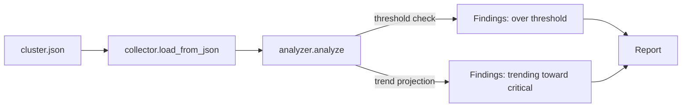

# infra-health-report

[](https://github.com/monicaslgc/infra-health-report/actions/workflows/tests.yml)

A small, dependency-free tool that turns raw VM/container resource metrics into a capacity report you can actually act on: what's over threshold right now, and what's trending toward trouble even if it looks fine today.

This is a portfolio project, not a copy of anything from a real environment. It's original code built around a problem I deal with on the support/ops side of my work: infrastructure metrics are easy to collect and hard to turn into "here's what needs attention this week" without someone doing that translation by hand.

## Why this pattern

A threshold check on its own only tells you what's already a problem. The more useful question is usually "is this going to be a problem soon," which needs at least two points in time and a bit of arithmetic, not a dashboard full of gauges someone has to remember to look at. This tool does the simplest version of that: a straight-line projection from two snapshots, good enough to turn "check again next week" into "this one needs attention this week."

## Architecture



- **collector** loads resource history from a JSON file. That's the whole "data source" in this demo, but it's a seam: a real deployment would add a second loader against whatever monitoring/hypervisor API is in use and return the same `list[Resource]`. The analyzer doesn't know or care where the data came from.
- **analyzer** checks each resource's latest CPU/memory/disk reading against threshold, and where there are at least two history points, computes a rough daily trend. A resource still under threshold today but climbing fast enough to cross it within 30 days gets flagged too, with a days-to-critical estimate.
- **thresholds** are plain warning/critical percentages per metric, deliberately simple and easy to override per resource if you needed to.

## Project layout

```
src/infrahealth/
  models.py       # Resource, MetricSample, Finding, Report, Severity
  collector.py    # loads inventory (JSON today, pluggable)
  thresholds.py   # default warning/critical thresholds
  analyzer.py     # threshold checks + trend projection
examples/
  cluster.json    # synthetic sample cluster
  run_report.py   # CLI entry point
tests/
  test_analyzer.py
  test_collector.py
```

## Running it

```bash
python examples/run_report.py
```

```bash
pip install -e ".[dev]"
pytest
```

No credentials, no live infrastructure connection. Everything runs against the sample JSON.

## Example output

```
Capacity report (cluster.json)
  1 critical, 2 warning, 1 trending toward critical
  [CRITICAL] node-a/auth-service mem_percent=93.0%
  [WARNING ] node-a/reporting-db disk_percent=88.0% -> projected to hit 95% in ~12d
  [WARNING ] node-b/queue-worker-1 cpu_percent=74.0% -> projected to hit 90% in ~25d
  [OK      ] node-c/log-collector disk_percent=79.0% -> projected to hit 95% in ~28d
```

## Extending it

- Add a second `collector` function that pulls from a real API instead of JSON; `analyze()` doesn't change.
- Make thresholds per-resource instead of global, since a database's disk threshold isn't the same as a stateless worker's.
- Swap the straight-line trend for something less naive (weighted recent history, seasonality) once you have more than two data points to work with.

## License

MIT, see [LICENSE](LICENSE).
